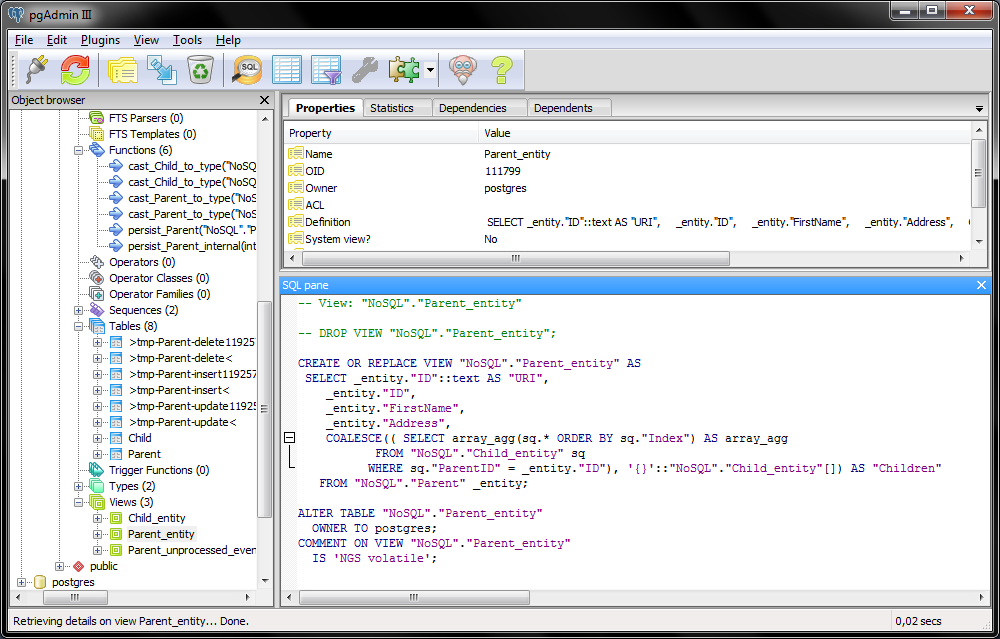
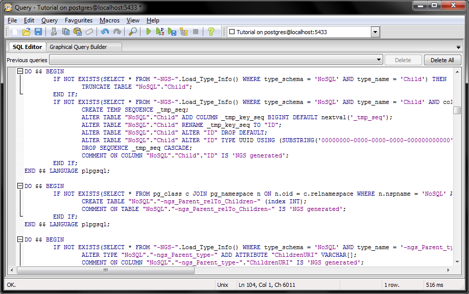
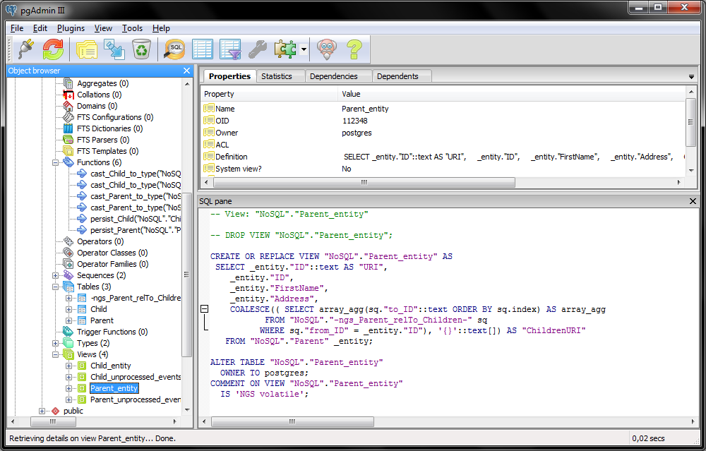
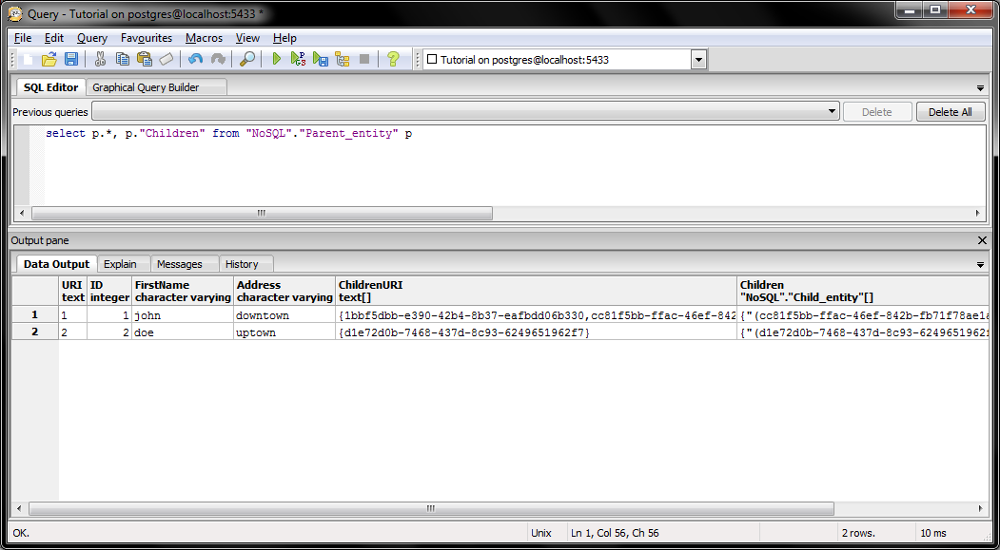
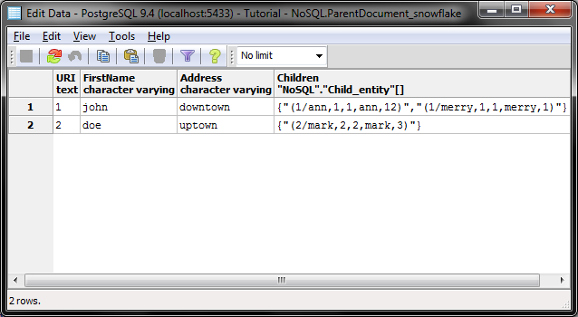
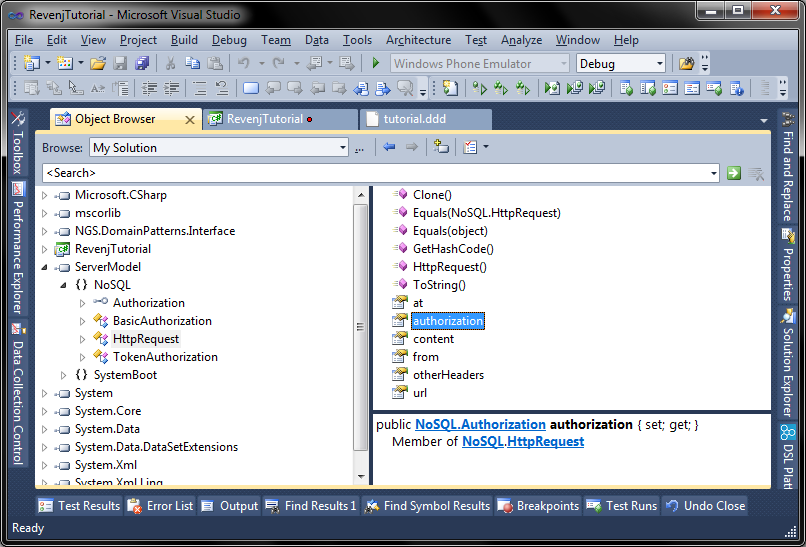
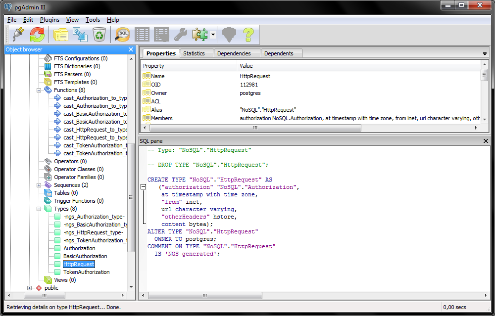

## Modeling NoSQL documents with Revenj in Postgres

Revenj can utilize advanced Postgres and Oracle features to provide advanced modeling capabilities, while remaining typesafe and easy to use. Such features are not new, but they are rarely utilized since they are too cumbersome to manage and much harder to evolve. But sometimes they can offer vast improvements over standard ways.

###The rise of NoSQL

DDD advocates modeling the domain as closely as possible. With only tables and columns, this is often impossible. So with the rise of NoSQL, a lot of people moved from ER modeling to document modeling with JSON. In this tutorial we will explore such complex models, how they can be consumed through Revenj and how are they implemented by DSL Platform.

In the initial [tutorial](revenj-tutorial-setup.md) we started off with an aggregate which had collections of primitives and value objects. While this shows the basic features of document modeling, there is a lot more to it. By leveraging DDD terminology of an aggregate root as a container for entities and value object, we can have relational representation of the document. Relational in a sense, that entities will be mapped to tables and value objects will be mapped to types. Sometimes relationship between entities will create a helper table so that relational integrity is maintained.

###Object-oriented relational database

Let's explore various examples to get a feel of the modeling capabilities. Wikipedia [Document-oriented-database page](http://en.wikipedia.org/wiki/Document-oriented_database) shows of an example of a document as:

    {
        FirstName: "Jonathan",
        Address: "15 Wanamassa Point Road",
        Children: [
             {Name: "Michael", Age: 10},
             {Name: "Jennifer", Age: 8},
             {Name: "Samantha", Age: 5},
             {Name: "Elena", Age: 2}
        ]
    } 

Such a document could be modeled in two basic ways inside of aggregate:

    aggregate Parent {
      string FirstName;
      string Address;
      List<Child> Children;
    }

One way of modeling is using value objects:

    value Child {
      string Name;
      int Age;
    }

another would be with the help of an entity:

    entity Child {
      string Name;
      int Age;
    }

usage of entity would actually create some additional columns to maintain relational integrity, but the database will provide it as a single object:

We can also model it several other ways. Child can maintain its own identity:

    aggregate Parent {
      string FirstName;
      string Address;
      Linked List<Child> *Children;
    }

    entity Child(ID) {
      uuid ID;
      string Name;
      int Age;
    }

This will create quite a complex migration script, which tries to preserve data if possible:

Child can reference the Parent, which is the closest to the standard ER modeling, while still providing a single object:

    aggregate Parent {
      string FirstName;
      string Address;
      detail<Child.Parent> Children;
    }

    entity Child {
      int ParentID;
      relationship Parent(ParentID) Parent;
      string Name;
      int Age;
    }

which looks almost the same as previous one:

Notice that Child entity doesn't actually have a primary key in this case. There are also slight variations where Child can have a natural key:

    entity Child(ParentID, Name);

While only the first example matches NoSQL document completely, other variants can provide improved performance if Child objects needs to be queried, since it's a standard database table.

If we want to decouple Parent and Child into two separate aggregates, we can just define Child as an aggregate, although some of the modeling will not be possible any more since, as an aggregate Child has to maintain its own PK, while in some scenarios above, it inherited the key from the parent:

    aggregate Parent {
      string FirstName;
      string Address;
      Stack<Child> *Children;
    }

    uuid aggregate Child {
      string Name;
      int Age;
    }

In this case Children property will be implemented as lazy load, both in the database and in the server, although exact identities for lazy load will be loaded immediately:

We will also have lazy load anti-pattern directly in the database:

If we need to use *ParentID* as part of the primary key, we can model as:

    aggregate Parent {
      string FirstName;
      string Address;
      detail<Child.Parent> Children;
    }

    aggregate Child(ParentID, Name) {
      Parent *Parent;
      string Name;
      int Age;
    }

since we have a detail to the Parent, we will have lazy property again. To reconstruct original NoSQL document we can create a snowflake over it such as:

    snowflake<Parent> ParentDocument {
      FirstName;
      Address;
      Children;
    }

This will create a view in the database which utilizes aggregation features to provide such a complex object:

**Note: last migration will only succeed when you don't have any data, since relationships are not equivalent.** All this modeling will create appropriate objects in the database and .NET code so they are ready to use. If we define Child as an entity inside an Person aggregate, there will be several helper objects in the database, since to persist such a composite, it needs to be unpacked into multiple tables. Unpacking can happen in the database for simple use-cases (when objects are not big), or optimized away in the repository objects. As already stated, DSL Platform provides best-practices implementation (at least currently implemented ones) so in the case of bulk insert/update, appropriate Postgres features will be utilized, such as [copy](http://www.postgresql.org/docs/9.2/static/sql-copy.html).

###Rich modeling support

There are also several other modeling constructs which can be used to implement such (or similar) document:

    aggregate Parent {
      string FirstName;
      string Address;
    }

    aggregate Child {
      Parent *Parent;
      string Name;
      int Age;
    }

    report ParentDocument {
      int id;
      Parent Parent 'it => it.ID == id';
      Child[] Children 'it => it.ParentID == id' order by ID;
    }

Report feature will also create an appropriate object in the database, but currently Revenj will call two LINQ queries to reconstruct it.
Populating report is done with the use of IReport API:

    var pd = new ParentDocument { id = 123 };
    var result = pd.Populate(locator);

Of course, entities can be nested in other entities, with values nested in entities and other values. Since entities are implemented as tables in the database, while values are implemented as types, some of the constructs are disallowed from value objects.

Because value object is not a table, it can't reference other tables and maintain referential integrity out of the box (it could with triggers, but that would create performance problems).

Enums can be used for simple enumerations and can be referenced from value objects. Various collection types can be used in code, but they all will be implemented as arrays in Postgres:

    aggregate Post {
      string Content;
      Set<Tag> Tags;
    }

    enum Tag { NoSQL; Revenj; DSL; }

*Due to suboptimal implementation of enum changes in Postgres, DSL Platform provides SQL script which hacks around it and requires superuser for running SQL script - this can cause issues in cloud services such as Amazon which disallow queries on certain system tables.*

If you try to reference another aggregate without a pointer, you'll get an error about embedding one aggregate inside another. But such use case can be useful, as in providing a snapshot version of that object. This is often useful in ERP software where objects need to be frozen in time. For example standard Invoice with a Customer and line items can be modeled as such:

    aggregate Customer {
      string Name;
      string Address;
    }
    
    aggregate Product {
      string Name;
      decimal Price;
    }

    aggregate Invoice {
      Customer *Customer { snapshot; }
      date DueDate;
      List<LineItem> Items;
    }

    entity LineItem {
      Product *Product { snapshot; }
      decimal quantity;
    }

Snapshot concept can be used to create a column in a table where current version of the requested object will be saved. While alternative syntax without the pointer or snapshot could achieve the same result, it was shown that it's not obvious to beginners how concepts relate; and thus the error message for the "invalid" DSL pointed them to the correct model.

Events are somewhat different since they store snapshot by default. This means that model such as

    event FinalizeInvoice {
      Invoice invoice;
      string(50) operator;
    }

is supported and will have a snapshot of Invoice as a column in the table, while pointer syntax is currently not allowed (in the future pointer syntax will probably be used to merge aggregate events with ordinary events).

While these are the basics, with the introduction of couple other concepts, modeling can be improved and eased greatly. Mixin concept has various applications, and one of them is to provide polymorphism in the database. If we have model such as:

    mixin Authorization;

    value BasicAuthorization {
      string username;
      string password;
      has mixin Authorization;
    }

    value TokenAuthorization {
      string token;
      has mixin Authorization;
    }

we'll get several things out of it. Interface Authorization will be created in .NET model, while classes BasicAuthorization and TokenAuthorization will implement such interface. If we use it in another object, such as:

    value HttpRequest {
      Authorization authorization;
      timestamp at;
      ip from;
      url url;
      map otherHeaders;
      binary content;
    }

It will have an interface as a property:

and a special type in Postgres:

Special types, such as map will be translated to appropriate Postgres features, such as hstore, while they will be implemented with appropriate types in .NET; in this case a Dictionary<string, string>.