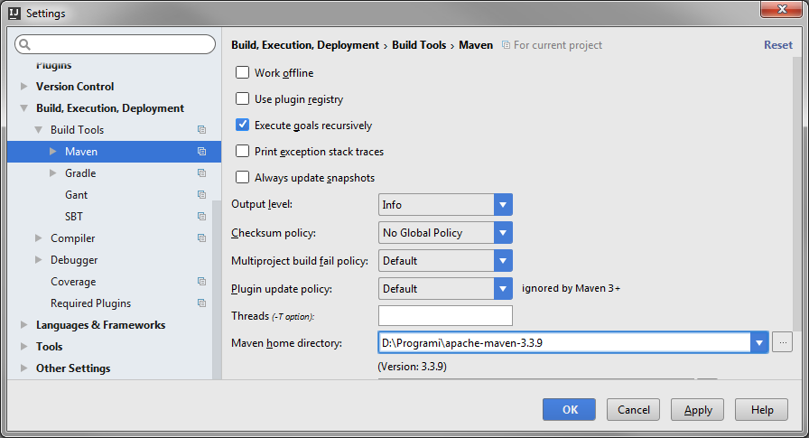
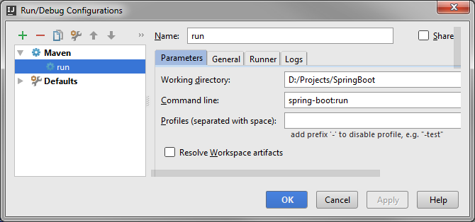
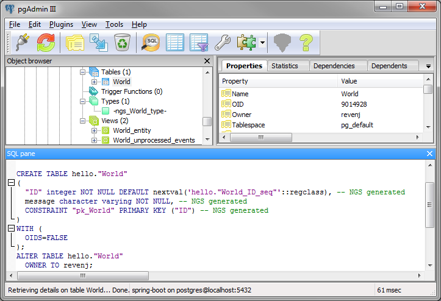
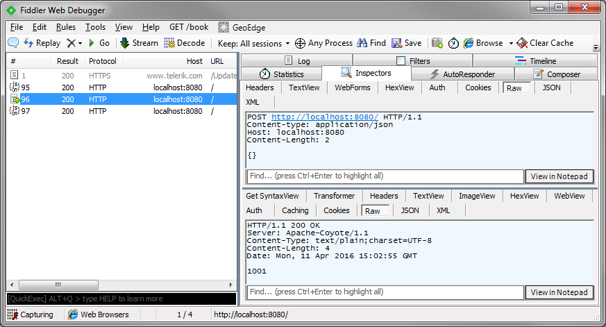
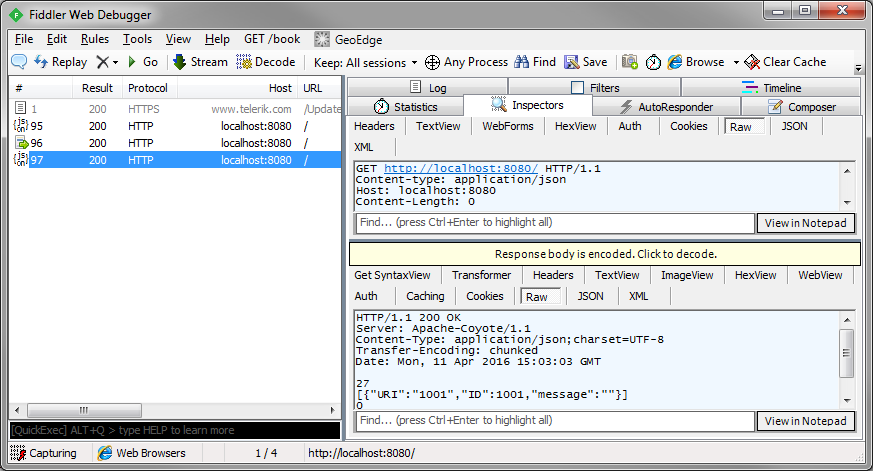
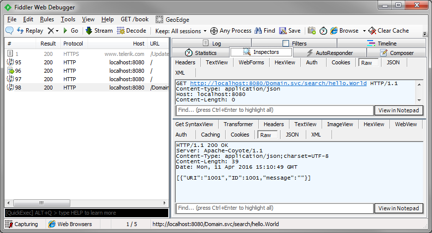

## Revenj tutorial with Spring Boot, Postgres and IDEA

**Revenj** is a set of libraries (framework) for JVM with advanced support for Postgres database. 
While it can be used as any other framework, it's rather small (feature wise) and it's best used as a backend for [DSL Platform](https://dsl-platform.com). 
This makes it ideal as a [REST service](http://c2.com/cgi/wiki?RestArchitecturalStyle) built on [DSL](http://c2.com/cgi/wiki?DomainSpecificLanguage) models, or within some other framework such as Spring. 

Spring boot is becoming *THE* Java framework and this tutorial will explore using two major features of Revenj inside Spring boot:

- [JINQ provider](http://www.jinq.org/) for Postgres, somewhat different from other JPA providers since it leverages object-oriented features. This allows for having a [NoSQL documents](http://en.wikipedia.org/wiki/Document-oriented_database) inside a relational databases.
- HTTP API to domain model is available through Servlet

This tutorial assumes basic understanding of Spring boot and is a continuation on top of [original Spring boot tutorial](https://spring.io/guides/gs/spring-boot/) using Maven.

In this tutorial we will wire up Revenj servlet as a REST service to get CRUD and other features out of the box. 
We need a working [Postgres (9.1+)](http://www.postgresql.org/), Java (1.8) and .NET/Mono (v4+).
This tutorial will use IntelliJ IDEA to setup development.
DSL Platform is a DSL compiler which converts provided DSL model to target code/SQL.

DSL Platform requires .NET/Mono, so we will need to have it on path. 
On Windows .NET should be available by default.
On Linux it can be installed through `sudo apt-get install mono-complete`.
For Mac [installer is available](http://www.mono-project.com/download/#download-mac) on project website.

###Setting up environment

Before starting up IDE, let's setup PostgreSQL database. Tutorial will assume:

 * database name - spring-boot
 * database user - revenj
 * database password - revenj
 * database port - 5432

either create such user and database or change appropriate connection strings in pom/properties.

For convenience project is [available for download](https://github.com/ngs-doo/revenj/blob/master/tutorials/examples/SpringBoot.zip).

Let's start a new Project based on Maven and using Java 1.8 as Project SDK.
We will need Maven (3.0.5 or newer) which should be provided with IDEA.

This should setup default `pom.xml` in which we will add various dependencies and DSL compilation process.
After we are done, `pom.xml` should look like:

    <groupId>spring-boot</groupId>
    <artifactId>revenj-boot</artifactId>
    <version>1.0-SNAPSHOT</version>
    <parent>
        <groupId>org.springframework.boot</groupId>
        <artifactId>spring-boot-starter-parent</artifactId>
        <version>1.3.3.RELEASE</version>
    </parent>
    <dependencies>
        <dependency>
            <groupId>org.springframework.boot</groupId>
            <artifactId>spring-boot-starter-web</artifactId>
        </dependency>
        <dependency>
            <groupId>org.revenj</groupId>
            <artifactId>revenj-spring</artifactId>
            <version>0.9.4</version>
        </dependency>
        <dependency>
            <groupId>org.revenj</groupId>
            <artifactId>revenj-servlet</artifactId>
            <version>0.9.4</version>
        </dependency>
    </dependencies>
    <build>
        <plugins>
            <plugin>
                <groupId>com.dslplatform</groupId>
                <artifactId>dsl-platform-maven-plugin</artifactId>
                <version>0.5</version>
                <executions>
                    <execution>
                        <phase>generate-sources</phase>
                        <goals>
                            <goal>generate-code</goal>
                            <goal>sql-migration</goal>
                        </goals>
                        <configuration>
                            <target>revenj.spring</target>
                            <settings>
								<setting>jackson</setting>
							</settings>
                            <postgres>localhost/spring-boot?user=revenj&amp;password=revenj</postgres>
                            <applySql>true</applySql>
                        </configuration>
                    </execution>
                </executions>
            </plugin>
            <plugin>
                <groupId>org.springframework.boot</groupId>
                <artifactId>spring-boot-maven-plugin</artifactId>
            </plugin>
        </plugins>
    </build>

where we have dependency to:

 * example Spring boot project
 * Revenj libraries for Servlet and Spring

and maven plugins for:

 * Java code generation from DSL
 * SQL migration based on difference in database and current DSL
 * Spring boot

Maven plugin for Revenj will be responsible for translating DSL code into Java code and upgrading the database.
We have also passed in setting configuration for creating Jackson annotations on our persistance model.

By adding new Run/debug configuration for Maven we can start our project from within the IDE through Command line argument `spring-boot:run`

###DSL introduction

Let's start with a minimal DSL and a simple [CRUD](http://en.wikipedia.org/wiki/Create,_read,_update_and_delete) operation to get a feeling what's happening. To write DSL, let's add a `dsl` folder and write a `model.dsl` file inside. IDEA should pick up that signature and offer to download [DSL Platform plugin](https://plugins.jetbrains.com/plugin/8227) (which will be used to syntax highlight our DSL).

An DSL example we can write is:

    module hello {
      aggregate World {
        string message;
      }
    }

which is slighly shorter version of a similar DSL:

    module hello {
      aggregate World(ID) {
        int ID { sequence; }
        string message;
      }
    }

This DSL will be converted into:

 * package *example* in Java with a class `World`
 * repository and converter for conversion between Postgres representation and Java instance
 * schema *example* in Postgres and a table named `World`

[Aggregate root](http://dddcommunity.org/resources/ddd_terms/) is an DSL concept from Domain-Driven Design which is converted into appropriate objects in various domains. For now it's easiest to consider it an entity from JPA.

If everything is working correctly, after build Maven plugin should update our `spring-boot` database, due to `applySql` = `true` argument.
SQL script will be saved to `sql` folder.
Alternatively we could use alternative migration mechanism instead of this convenient development setup.

Migrated database should look like:

To CRUD it we can either use builtin [REST-like API](https://github.com/ngs-doo/revenj/blob/master/java/revenj-servlet/src/main/java/org/revenj/server/servlet/CrudServlet.java) available in a Servlet jar provided with Revenj or write manual mappings in Spring controllers.

###Integrating with Spring

Rest plugin will open up endpoint which is available (by default) via `/Crud.svc/example.Post` url,
while in Spring we will define exact mapping.

Spring boot application should be configured with a class such as:

    @SpringBootApplication @Configuration
    public class Application implements ServletContextInitializer, WebApplicationInitializer {    
    
        public static void main(String[] args) throws Exception {
            SpringApplication.run(Application.class, args);
        }
    
        private final Container container;
        private final DataSource dataSource;

        public Application() throws IOException {
            container = Revenj.setup();
            RevenjStartup.setup(container);
            dataSource = container.resolve(DataSource.class);
        }
        @Override public void onStartup(ServletContext servletContext) throws ServletException {
            try {
                org.revenj.server.servlet.Application.configure(servletContext, container);
                org.revenj.spring.RevenjStartup.setup(container);
                //configure jackson inject attribute
                JacksonSetup.findJackson(handlerAdapter).ifPresent(m -> {
                    ObjectMapper mapper = m.getObjectMapper();
                    if (mapper == null) mapper = new ObjectMapper();
                    mapper.setInjectableValues(new InjectableValues.Std().addValue("__locator", container));
                    m.setObjectMapper(mapper);
                });
            } catch (Exception ex) {
                throw new ServletException(ex);
            }
        }
        @Bean public ServiceLocator serviceLocator() throws IOException {
            return container;
        }
        @Bean public DataSource dataSource() throws IOException {
            return dataSource;
        }
        @Bean public DataContext dataContext(ServiceLocator locator) {
            return locator.resolve(DataContext.class);
        }
    }

where we have wired Revenj startup endpoint with rest of Spring and provided several dependencies for download.
We have also configured Jackson to be able to deserialize DSL POJO objects which have dependency on the `ServiceLocator` (alternatively we could use DslJson library which supports them out-of-the-box).

Finally we need a `revenj.properties` file (or we need to start Revenj using some other method). File should contain jdbc url to the database,
eg:

    revenj.jdbcUrl=jdbc:postgresql://localhost/spring-boot?user=revenj&password=revenj

Now we can write a simple controller:

    @RestController
    public class HelloController {

        @Autowired
        DataContext context;

        @RequestMapping("/")
        public List<World> index() {
            return context.search(World.class);
        }

        @RequestMapping(value = "/", method = RequestMethod.POST)
        public String index(@RequestBody World world) throws IOException {
            context.create(world);
            return world.getURI();
        }
    }
	
which will list all our `World` objects on `GET` and create a new one on `POST`.

Alternatively we can use Revenj servlet API for such a purpose:

Revenj Servlets are configured in [Application](https://github.com/ngs-doo/revenj/blob/master/java/revenj-servlet/src/main/java/org/revenj/server/servlet/Application.java#L68)

`DataContext` service autowired into our controller is main entry point to all repositories available in Revenj models.